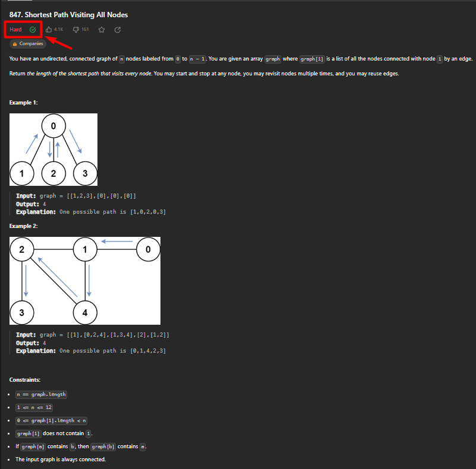

# Problemas de Grafos

**Número da Lista**: 1

**Conteúdo da Disciplina**: Grafos 1

## Aluno

|Matrícula | Aluno |
| -- | -- |
| 21/1029559  | [Rafael Brito Bosi Rodrigues](https://github.com/StrangeUnit28) |

## Sobre

Repositório destinado a guardar as soluções de alguns problemas de grafos encontrados online. Os problemas podem ser encontrados mais abaixo nesse READE.ME, junto com o link das questões, caso o leitor se interesse por tentar resolve-los.

As questões apresentam diferentes níveis de dificuldade, classificadas pelos próprios sites onde foram realizadas. Todas as questões aqui presentes foram resolvidas com 100% de aceitação pelos juizes online.

O primeiro problema é o "847 - Shortest Path Visiting All Nodes" - disponível em: [Leetcode.com](https://leetcode.com/problems/shortest-path-visiting-all-nodes/description/). Classificado como difícil.

O segundo problema foi o 

O terceiro problema foi o 

## "847 - Shortest Path Visiting All Nodes"

## 

