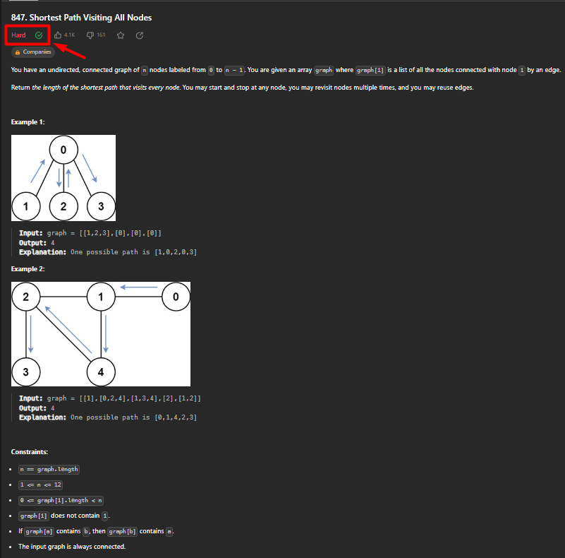
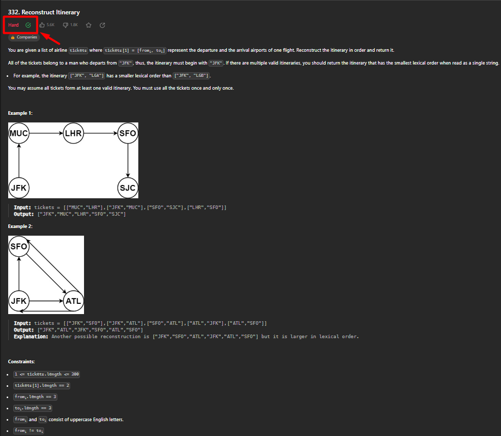
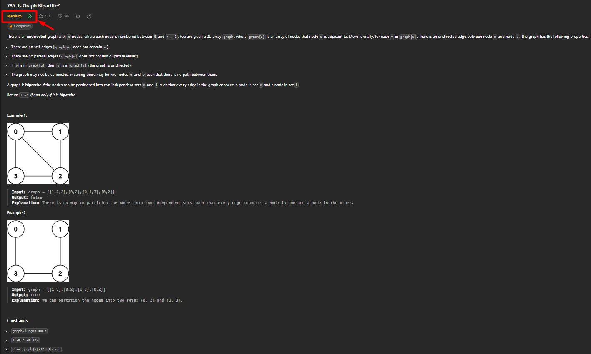

# Problemas de Grafos

**Número da Lista**: 1

**Conteúdo da Disciplina**: Grafos 1

## Aluno

|Matrícula | Aluno |
| -- | -- |
| 21/1029559  | [Rafael Brito Bosi Rodrigues](https://github.com/StrangeUnit28) |

## Sobre

Repositório destinado a guardar as soluções de alguns problemas de grafos encontrados online. Os problemas podem ser encontrados mais abaixo nesse READE.ME, junto com o link das questões, caso o leitor se interesse por tentar resolve-las.

As questões apresentam diferentes níveis de dificuldade, classificadas pelos próprios sites onde foram realizadas. Todas as questões aqui presentes foram resolvidas com 100% de aceitação pelos juizes online.

- O primeiro problema é o "847 - Shortest Path Visiting All Nodes" - disponível em: [Leetcode.com](https://leetcode.com/problems/shortest-path-visiting-all-nodes/description/). 

Exercício classificado como **Difícil**.

- O segundo problema foi o "332 - Reconstruct Itinerary" - disponível em: [Leetcode.com](https://leetcode.com/problems/reconstruct-itinerary/description/). 

Exercício classificado como **Difícil**.

- O terceiro problema foi o "785 - Is Graph Bipartite?" - disponível em: [Leetcode.com](https://leetcode.com/problems/is-graph-bipartite/description/). 

Exercício classificado como **Médio**.

## 847 - Shortest Path Visiting All Nodes

Na imagem acima é possível ver a descrição do problema, além disso a solução para esse exercício pode ser encontrada [aqui](./leetcode_847/). Para mais explicações sobre o problema e sobre a solução proposta, assista o vídeo disponível no final desse documento.

## 332 - Reconstruct Itinerary

Na imagem acima é possível ver a descrição do problema, além disso a solução para esse exercício pode ser encontrada [aqui](./leetcode_332/). Para mais explicações sobre o problema e sobre a solução proposta, assista o vídeo disponível no final desse documento.

## 785 - Is Graph Bipartite?

Na imagem acima é possível ver a descrição do problema, além disso a solução para esse exercício pode ser encontrada [aqui](./leetcode_785/). Para mais explicações sobre o problema e sobre a solução proposta, assista o vídeo disponível no final desse documento.

## Vídeos de explicação

<iframe width="560" height="315" src="https://www.youtube.com/embed/zp29guH1ebQ?si=EnApkDf_OopE7A24" title="YouTube video player" frameborder="0" allow="accelerometer; autoplay; clipboard-write; encrypted-media; gyroscope; picture-in-picture; web-share" allowfullscreen></iframe>

Vídeo 1 - Exercício 847

<iframe width="560" height="315" src="https://www.youtube.com/embed/xfunUtEhdB8?si=t7MDi4BAEfjjbNTD" title="YouTube video player" frameborder="0" allow="accelerometer; autoplay; clipboard-write; encrypted-media; gyroscope; picture-in-picture; web-share" allowfullscreen></iframe>

Vídeo 2 - Exercício 332

<iframe width="560" height="315" src="https://www.youtube.com/embed/f6UxY39cvSI?si=aNThk8DO-Bi2IUnr" title="YouTube video player" frameborder="0" allow="accelerometer; autoplay; clipboard-write; encrypted-media; gyroscope; picture-in-picture; web-share" allowfullscreen></iframe>

Vídeo 3 - Exercício 785

